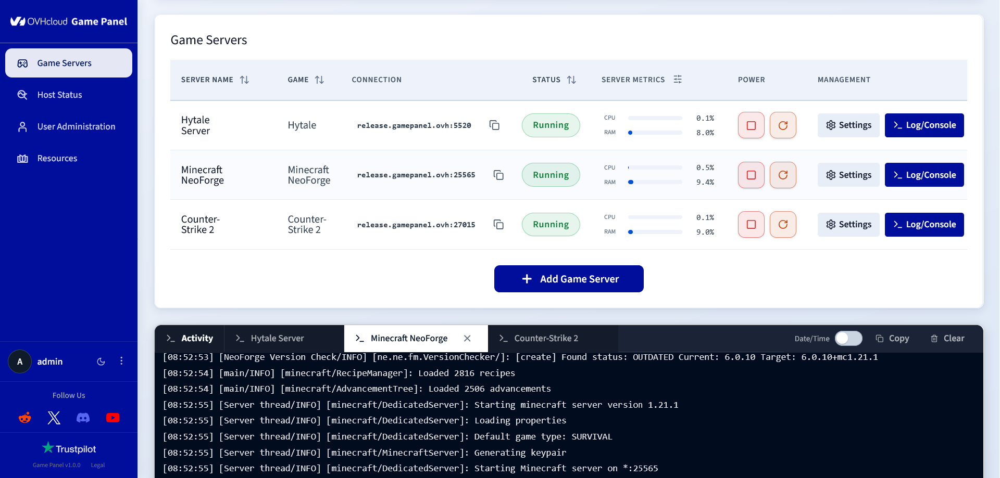

<div align="center">

# 🎮 OVHcloud Game Panel

### Deploy and manage your game servers in minutes — from one clean, modern web interface.

[](LICENSE)

[](https://www.ovhcloud.com/)



</div>

<br>

OVHcloud Game Panel is an **open-source, self-hosted** control panel to deploy, run, and monitor your game servers — **without ever touching the command line**. Spin up a Minecraft, Counter-Strike 2, Hytale, or Palworld server in a few clicks, then manage its files, backups, player access, and performance from a single modern dashboard. 🚀

## ✨ Features

- 🎛️ Complete server lifecycle management (create, start, stop, restart…).
- 📊 Live status, logs, metrics, and installation tracking.
- 🕹️ Interactive in-browser game console.
- 📁 Powerful built-in file manager.
- 💾 One-click backups and restores.
- ⏰ Flexible task scheduling.
- 🐳 Advanced container configuration.
- 🔐 Fine-grained user permissions.
- 📈 Real-time host monitoring.
- 💻 Integrated container terminal.
- 🔄 Built-in one-click panel updater.

## 🕹️ Supported games

**Natively supported**, ready to deploy with OVHcloud-maintained images:

- **Minecraft** — Java Edition, Paper, Fabric, NeoForge, and Bedrock Edition
- **Counter-Strike 2**
- **Hytale**
- **Palworld**

**And many more.** Game Panel integrates the full [LinuxGSM](https://linuxgsm.com/servers/) library, giving you a huge catalogue of additional dedicated game servers out of the box.

Your game isn't listed? You can also **add any external Docker image** and run it straight from the panel. 🐳

## 🚀 Installation

### ⚡ Automatic — OVHcloud VPS or Dedicated Server (recommended)

Game Panel can be installed **automatically, in one click**, when you deploy an OVHcloud **VPS** or **Dedicated Server**. *(Guide coming soon.)*

### 🛠️ Manual installation

**Prerequisites:**

- a Linux machine running Debian 12/13 or Ubuntu 22.04 / 24.04 / 25.10 / 26.04;
- a domain name pointing to the machine's public IP address;
- shell access with administrative privileges.

Don't have the infrastructure yet? 🌐 [Domain name](https://www.ovhcloud.com/en-ie/domains/) · 🖥️ [VPS](https://www.ovhcloud.com/en-ie/vps/) · 🗄️ [Dedicated server](https://www.ovhcloud.com/en-ie/bare-metal/)

**Command to run:**

```bash
sudo apt install git
git clone https://github.com/ovh/game-panel.git
cd game-panel
sudo bash ./deploy/install.sh
```

During installation, you'll be prompted for:

- Domain name
- Admin password
- Admin username (optional, default: `admin`)
- Let's Encrypt email

Once installed, your panel is live at **`https://<your-domain>`** 🎉

> 📡 OVHcloud Game Panel sends usage telemetry by default. You can disable it at install with `--telemetry-disabled`. See [docs/TELEMETRY.md](docs/TELEMETRY.md).

## 🏗️ Architecture

Under the hood, a **React + Vite** frontend talks to a **Node.js** backend (Express, WebSocket, SQLite) that orchestrates the full server lifecycle — files, backups, permissions, metrics, and container configuration — through the **Docker** engine.

- `frontend/` — React and Vite user interface.
- `backend/` — Node.js, Express, WebSocket, and SQLite backend.
- `docker-images/` — OVHcloud game server images and operational images.
- `deploy/` — self-hosted installation and update scripts.

## 📚 Documentation & support

- 📋 [Changelog](CHANGELOG.md)
- 📡 [Telemetry](docs/TELEMETRY.md)
- 💬 [Contact OVHcloud support](https://www.ovhcloud.com/en/contact/)

## 📄 License

Licensed under the **Apache License 2.0** — see [LICENSE](LICENSE).
